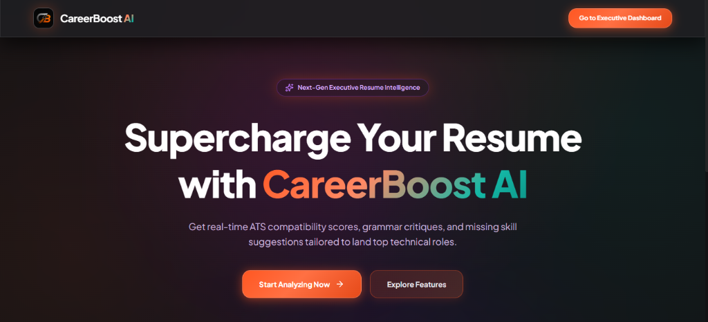
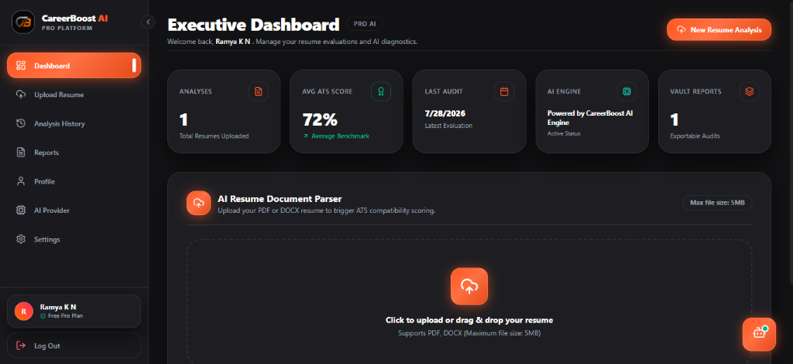
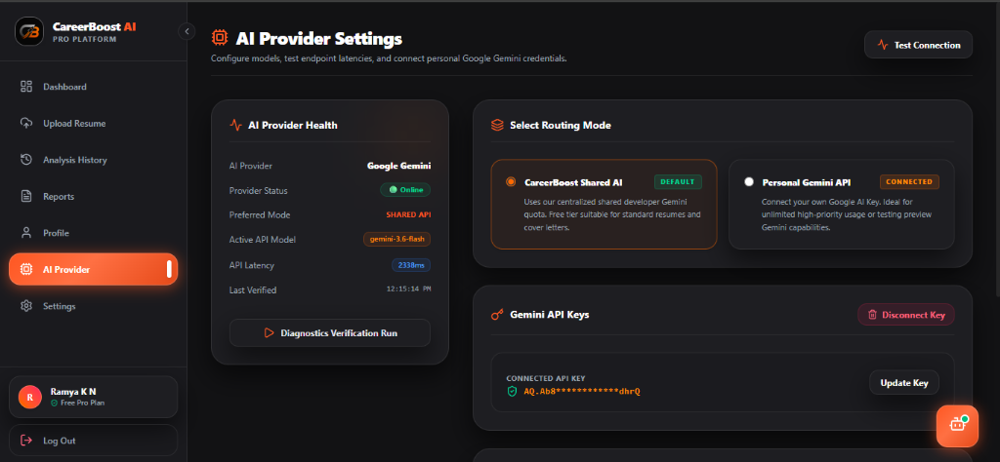

# 🚀 CareerBoost AI

<div align="center">

## AI-Powered Career Development Platform

**CareerBoost AI combines AI-powered resume analysis with a personalized AI Career Coach to help students and professionals optimize resumes, improve ATS scores, prepare for interviews, and accelerate their career growth.**

[](https://career-boost-ai-snowy.vercel.app)
[](https://github.com/ramyakn1907/CarrerBoostAI)

</div>

---

# 📌 Overview

CareerBoost AI is a full-stack AI-powered web application designed to help students and professionals strengthen their resumes, improve ATS compatibility, prepare for interviews, and receive personalized career guidance.

The platform combines intelligent resume analysis with a context-aware AI Career Coach that understands each user's resume, skills, education, and career goals. Based on this context, it provides tailored recommendations, interview preparation, learning roadmaps, project suggestions, and practical career advice.

---

# 🌟 Highlights

- 🤖 Personalized AI Career Coach powered by Google Gemini
- 📄 AI-powered Resume Analysis
- 📊 ATS Score Evaluation
- 💬 Context-aware Career Guidance
- 🔐 Secure JWT Authentication
- 🔒 Encrypted Personal Gemini API Keys
- ⚙️ Shared & Personal AI Provider Support
- ☁️ Cloud Deployment using Vercel & Render
- 🗄️ MongoDB Atlas Cloud Database

---

# ✨ Features

## 🔐 Authentication

- User Registration
- User Login
- JWT Authentication
- Password Hashing
- Protected Routes
- User Profile Management

---

## 📄 Resume Analysis

- Upload Resume (PDF)
- AI-powered Resume Analysis
- ATS Score Calculation
- Resume Strength Evaluation
- Missing Skills Detection
- Resume Improvement Suggestions
- Resume Keyword Recommendations

---

## 🤖 AI Career Coach

CareerBoost AI includes an intelligent AI assistant capable of providing:

- Personalized Career Guidance
- Resume Review
- ATS Optimization Tips
- Technical Interview Preparation
- HR Interview Preparation
- Learning Roadmaps
- Skill Recommendations
- Career Planning
- Project Suggestions
- Certification Recommendations
- Technology Explanations

The assistant understands the uploaded resume and provides personalized responses instead of generic chatbot replies.

---

## ⚙️ AI Provider Settings

Users can choose between:

- Shared Gemini API
- Personal Gemini API

Features include:

- API Key Verification
- Secure API Key Encryption
- Dynamic Model Detection
- AI Connection Health Monitoring
- Latency Testing
- Model Selection
- API Status Monitoring

---

## 📊 Dashboard

- Resume Upload
- Resume History
- Analysis Reports
- AI Career Coach
- AI Settings
- User Profile
- Account Settings

---

# 🛡 Security

CareerBoost AI follows secure development practices.

- JWT Authentication
- Password Hashing using bcrypt
- Encrypted Personal API Keys
- Protected Backend APIs
- Secure Environment Variables
- Input Validation using Pydantic

---

# 🏗 Tech Stack

## Frontend

- React.js
- Vite
- Tailwind CSS
- React Router
- Axios
- Framer Motion

## Backend

- FastAPI
- Python
- Uvicorn
- Pydantic
- Passlib
- JWT Authentication

## Database

- MongoDB Atlas

## Artificial Intelligence

- Google Gemini API

## Deployment

- Vercel
- Render

## Version Control

- Git
- GitHub

---

# 📂 Project Structure

```text
CareerBoostAI
│
├── backend
│   ├── app
│   │   ├── ai
│   │   ├── config
│   │   ├── models
│   │   ├── routers
│   │   ├── services
│   │   ├── templates
│   │   └── utils
│   │
│   ├── requirements.txt
│   └── .env.example
│
├── frontend
│   ├── public
│   ├── src
│   │   ├── assets
│   │   ├── components
│   │   ├── context
│   │   ├── layouts
│   │   ├── pages
│   │   └── services
│   │
│   ├── package.json
│   └── vite.config.js
│
├── screenshots
│   ├── home.png
│   ├── dashboard.png
│   ├── resume-analysis.png
│   └── ai-career-coach.png
│
└── README.md
```

---

# 🚀 Live Demo

🌐 **Application**

https://career-boost-ai-snowy.vercel.app

---

# 📸 Screenshots

## 🏠 Home Page



---

## 📊 Dashboard



---

## 📄 Resume Analysis


---

## 🤖 AI Career Coach



---

# ⚙️ Installation

## Clone Repository

```bash
git clone https://github.com/ramyakn1907/CarrerBoostAI.git
```

---

## Backend Setup

```bash
cd backend

python -m venv venv

venv\Scripts\activate

pip install -r requirements.txt

uvicorn app.main:app --reload
```

Create a `.env` file:

```env
MONGODB_URL=

DATABASE_NAME=

JWT_SECRET=

GEMINI_API_KEY=
```

---

## Frontend Setup

```bash
cd frontend

npm install

npm run dev
```

---

# 🧠 AI Career Coach

The AI Career Coach understands the uploaded resume and provides personalized career guidance.

It can help users:

- Improve ATS Scores
- Enhance Resume Quality
- Prepare for Interviews
- Explain Technical Concepts
- Recommend Projects
- Suggest Certifications
- Build Personalized Learning Roadmaps
- Plan Career Growth
- Answer Career-related Questions

---

# 🌟 Future Enhancements

- AI Mock Interview Simulator
- Resume Builder
- Cover Letter Generator
- LinkedIn Profile Analyzer
- Job Recommendation Engine
- Skill Gap Analysis
- Company-specific Interview Preparation
- AI Voice Career Coach
- Multi-language Support
- Mobile Application

---

# 📄 License

This project is intended for educational, learning, and portfolio purposes.

---

# 👩‍💻 Developer

**Ramya K N**

- 🌐 Live Demo: https://career-boost-ai-snowy.vercel.app
- 💻 GitHub: https://github.com/ramyakn1907

---

<div align="center">

### ⭐ If you found this project useful, consider giving it a star!

Built with ❤️ using **React**, **FastAPI**, **MongoDB Atlas**, and **Google Gemini AI**.

</div>
